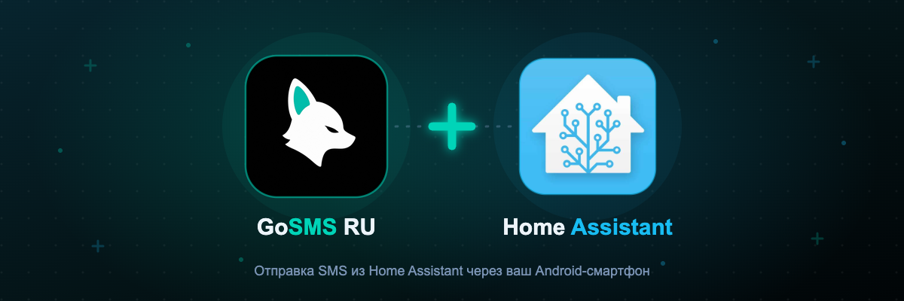

# GoSMS RU — интеграция для Home Assistant



Отправка SMS из Home Assistant через ваш Android-смартфон с приложением
[GoSMS Client](https://gosms.ru). Сообщения уходят через вашу SIM-карту по
тарифу вашего оператора — без SMS-агрегаторов и посредников.

## Содержание

- [Возможности](#возможности)
- [Установка](#установка)
  - [Вариант 1: через HACS (рекомендуется)](#вариант-1-через-hacs-рекомендуется)
  - [Вариант 2: вручную, без HACS](#вариант-2-вручную-без-hacs)
- [Настройка](#настройка)
- [Использование в автоматизациях](#использование-в-автоматизациях)
- [Решение проблем](#решение-проблем)
- [Ссылки](#ссылки)

## Возможности

- **Сервис `gosms.send_sms`** — отправка SMS из автоматизаций и скриптов:
  номер, текст (до 170 символов), выбор конкретного устройства, режим
  «не сохранять в истории».
- **Сенсоры по каждому устройству**: заряд батареи, активная SIM-карта.
- **Бинарные сенсоры**: онлайн-статус, зарядка, разрешение отправки SMS.
- Новые устройства подхватываются автоматически, без перезагрузки HA.
- При истечении или отзыве API-ключа Home Assistant предложит ввести новый
  (re-auth flow).
- Интерфейс на русском и английском.

## Установка

### Вариант 1: через HACS (рекомендуется)

Подходит, если у вас установлен [HACS](https://hacs.xyz). Плюс этого способа —
обновления интеграции будут приходить автоматически.

1. Откройте **HACS → Integrations → ⋮ (меню справа сверху) → Custom repositories**.
2. Добавьте репозиторий `https://github.com/GoSMS-new/home-assistant`,
   категория — **Integration**.
3. Найдите в списке «GoSMS RU» и нажмите **Download**.
4. Перезапустите Home Assistant: **Настройки → Система → Перезапустить**.

### Вариант 2: вручную, без HACS

Подходит для любой установки Home Assistant — HACS не требуется.

1. Скачайте код интеграции: на странице репозитория нажмите
   **Code → Download ZIP** и распакуйте архив (или `git clone`).

2. Скопируйте папку `custom_components/gosms` из архива в каталог
   конфигурации Home Assistant — туда, где лежит `configuration.yaml`:

   | Тип установки HA | Где каталог конфигурации |
   |---|---|
   | Home Assistant OS / Supervised | `/config` (доступ через аддоны File editor, Samba или SSH) |
   | Docker (Container) | каталог хоста, примонтированный к `/config` |
   | Home Assistant Core (venv) | `~/.homeassistant` |

   Если папки `custom_components` ещё нет — создайте её рядом с
   `configuration.yaml`. Итоговая структура должна быть такой:

   ```text
   <config>/
   ├── configuration.yaml
   └── custom_components/
       └── gosms/
           ├── __init__.py
           ├── manifest.json
           ├── services.yaml
           └── ...
   ```

3. Перезапустите Home Assistant: **Настройки → Система → Перезапустить**.

4. Проверьте, что интеграция появилась: **Настройки → Устройства и службы →
   Добавить интеграцию** → в поиске введите «GoSMS RU».

Обновление при ручной установке: скачайте свежий архив и замените папку
`custom_components/gosms` целиком, затем перезапустите HA.

## Настройка

1. Создайте API-ключ: [my.gosms.ru](https://my.gosms.ru) → **API Интеграция** →
   **Создать ключ**. Ключу нужны разрешения **devices:read** и **sms:send**.
2. В Home Assistant: **Настройки → Устройства и службы → Добавить интеграцию →
   GoSMS RU** и вставьте ключ.

После подключения для каждого Android-устройства из вашего аккаунта появятся
сенсоры (батарея, SIM, онлайн, зарядка, отправка SMS).

## Использование в автоматизациях

Действие «GoSMS RU: Отправить SMS» доступно в визуальном редакторе
автоматизаций — поля: номер, сообщение, ID устройства, история сообщений.

То же самое в YAML:

```yaml
automation:
  - alias: "SMS при открытии входной двери"
    trigger:
      - platform: state
        entity_id: binary_sensor.front_door
        to: "on"
    action:
      - service: gosms.send_sms
        data:
          phone: "+79001234567"
          message: "Входная дверь открыта!"
          # device_id: "550e8400-e29b-41d4-a716-446655440000"  # необязательно
          # no_store: true   # необязательно: не сохранять в истории
```

Если `device_id` не указан, GoSMS выберет любое доступное онлайн-устройство.
Максимальная длина сообщения — 170 символов.

## Решение проблем

- **«Неверный API-ключ»** — проверьте, что ключ активен и имеет разрешения
  `devices:read` и `sms:send` (my.gosms.ru → API Интеграция).
- **SMS не отправляется** — проверьте бинарный сенсор «Онлайн» устройства и
  что в приложении GoSMS Client разрешена отправка SMS.
- **Интеграция не появилась в поиске после ручной установки** — убедитесь,
  что файлы лежат именно в `<config>/custom_components/gosms/` (внутри должен
  быть `manifest.json`), и перезапустите HA ещё раз.
- Подробные логи: добавьте в `configuration.yaml`:

  ```yaml
  logger:
    logs:
      custom_components.gosms: debug
  ```

## Ссылки

- Документация GoSMS API: <https://docs.gosms.ru>
- Панель управления: <https://my.gosms.ru>
- Баг-репорты: <https://github.com/GoSMS-new/home-assistant/issues>
